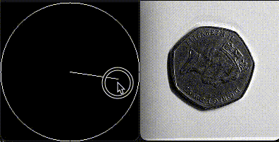
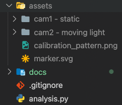
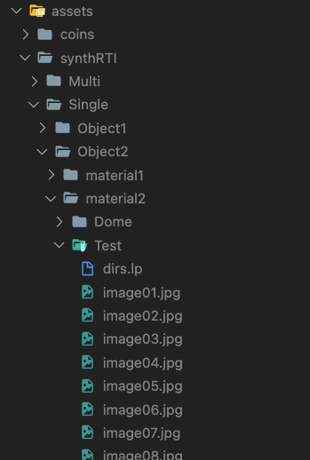

# 🐍📷  Smartphone Based RTI


[](https://www.python.org/)
[](https://pytorch.org/)

**Reflectance Transformation Imaging** (RTI) using footage from two smartphones without requiring an expensive light dome, created in **Python** utilizing **OpenCV** .

## 🎥 Input


> Footage by professor Filippo Bergamasco (Ca' Foscari University of Venice)

## 🕹 Output (interactive)



This project is the assignment for the course **Geometric and 3D Computer Vision 2020/2021**.

See **[FinalProject.pdf](FinalProject.pdf)** for more details on the assignment and to download the required assets.

## 📦 Downloading assets (CoinDataset)

Before running the scripts you need to download the required assets, the assets should include:

- The calibration videos for both cameras
- The footage from the static camera
- The footage from the moving camera

You need extract them inside a new folder called `assets/coins` in the root of the project.
Your folder structure should look like this:



> If you want you can change the location of the input files by changing the corresponding row on the file `constants.py` under the heading: `COINS ASSETS FILE NAMES AND DELAY BETWEEN FOOTAGE`.

## 📦 Downloading assets (SynthRTIDataset)

The scripts also supports the  from the paper "Neural Reflectance Transformation Imaging".
To use it, in each folder the assets should include:

- The images in jpg format
- A file named: "dirs.lp"
- An image called "normals.png" (Not required)

You need extract them inside a new folder called `assets/synthRTI` in the root of the project.
Your folder structure should look like this:



## 🔧 Usage

After downloading the assets you can just run this commands and follow the TUI:

```bash
python3 camera_calibrator.py        # Get camera intrinsics
python3 analysis.py                 # Get data or model from footage
python3 interactive_relighting.py   # View output
```

> In the case of the machine learning models you can skip the interpolation step and compute the output in real time.

## ⚙️ Interpolation methods available

- **Linear RBF** (_From the scipy library_)
- **Polinomial Texture Maps** (_Based on the homonymous paper from: Tom Malzbender, Dan Gelb, Hans Wolters_)
- **PCA Model** (_Machine learning model based on the paper: On-the-go Reflectance Transformation Imaging with Ordinary Smartphones, from Mara Pistellato and Filippo Bergamasco_)

## 🔬 Analysis debug modes descriptions

| #   | Mode name     | Features                                                                         |
| --- | ------------- | -------------------------------------------------------------------------------- |
| 0   | No debug      | -                                                                                |
| 1   | Minimal debug | Live footage, Current light direction, marker's contours                         |
| 2   | Full debug    | Minimal debug, Moving camera threshold, Warped moving frame, highlighted corners |
